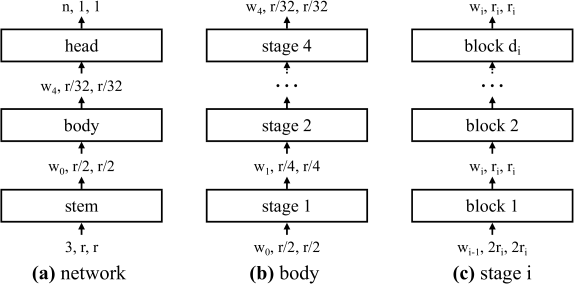
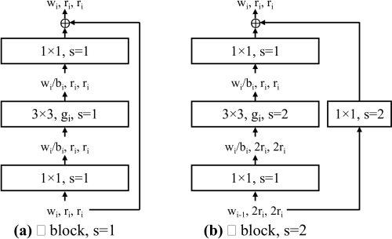

# Regnet

## Introduction

Here is our pytorch pytorch implementation of network design paradigm described in the paper "Designing Network Design Spaces"
<p align="center">
  <br/>
  <i>Design space design</i>
</p>

## Network stucture

<p align="center">
  <br/>
  <i>Generalnetwork  structure</i>
</p>

<p align="center">
  <br/>
  <i>X Block</i>
</p>

## Best models

<p align="center">
  <br/>
  <i>Top RegNetX models</i>
</p>

<p align="center">
  <br/>
  <i>Top RegNetY models</i>
</p>

## Datasets

We use Imagenet (ILSVRC2012) for all experiments, as stated in the paper
Create a data folder under this repository,

```
cd {repo_root}
mkdir data
```

- **ImageNet**:
  Download the ImageNet dataset and put the files as the following structure:
  ```
  data
  ├── train
  │   ├── n01440764
  │   └── n01443537
  │   └── ...
  │── val
  │   ├── n01440764
  │   └── n01443537
  │   └── ...
  ```
  Of course you could change this path to whatever you want based on your own preference, or mount it to a folder when using docker.

## How to use our code

With our code, you can:

* **Train your model** with default arguments by running **python train.py -d path/to/image/root/folder**

## Requirements

* **python 3.7**
* **pytorch 1.4**
* **opencv (cv2)**

## Updating (21/04/2020)
Complete all networks and training script. We are training RegnetY models and will update result soon.