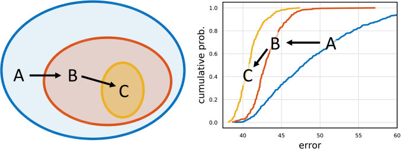
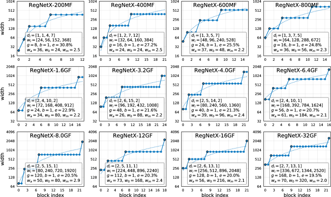
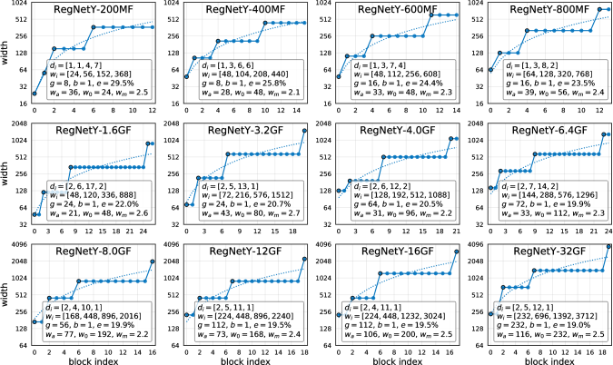

# Regnet

## Introduction

Here is our pytorch pytorch implementation of network design paradigm described in the paper "Designing Network Design Spaces"
<p align="center">
  <br/>
  <i>Design space design</i>
</p>

## Comparison

P: Paper's. O: Our

| Model | [P/O] gflops | [P/O] params |  [P/O] top-1 error |
| :------: | :------: | :------: | :-----: |
| RerNetY-200MF | 0.2/0.22 | 3.2/3.27 | 29.6/updating... |
| RerNetY-400MF | 0.4/0.42 | 4.3/4.45 | 25.9/updating... |
| RerNetY-600MF | 0.6/0.60 | 6.1/5.66 | 24.5/updating... |
| RerNetY-800MF | 0.8/0.82 | 6.3/6.26 | 23.7/updating... |


## Best models

<p align="center">
  <br/>
  <i>Top RegNetX models</i>
</p>

<p align="center">
  <br/>
  <i>Top RegNetY models</i>
</p>


## Datasets

We use Imagenet (ILSVRC2012) for all experiments, as stated in the paper.

Create a data folder under this repository,

```
cd {repo_root}
mkdir data
```

- **ImageNet**:
  Download the ImageNet dataset and put the files as the following structure:
  ```
  data
  ├── train
  │   ├── n01440764
  │   └── n01443537
  │   └── ...
  │── val
  │   ├── n01440764
  │   └── n01443537
  │   └── ...
  ```
  Of course you could change this path to whatever you want based on your own preference, or mount it to a folder when using docker.

## How to use our code

With our code, you can:

* **Train your model** with default arguments by running **python train.py -d path/to/image/root/folder**
* We also provide shell scripts which could be used to run training for first RegnetY models at **./scripts/**. For example, if you want to train RegNetY 800MF, you could simply run **./scripts/RegnetY_800MF.sh** 
## Requirements

* **python 3.7**
* **pytorch 1.4**
* **opencv (cv2)**
* **pthflops**
* **torchsummary**

## Updating (21/04/2020)
Complete all networks and training script. We are training RegnetY models and will update result soon.

## References

- [facebookresearch/pycls](https://github.com/facebookresearch/pycls)
- [pytorch/examples](https://github.com/pytorch/examples)
